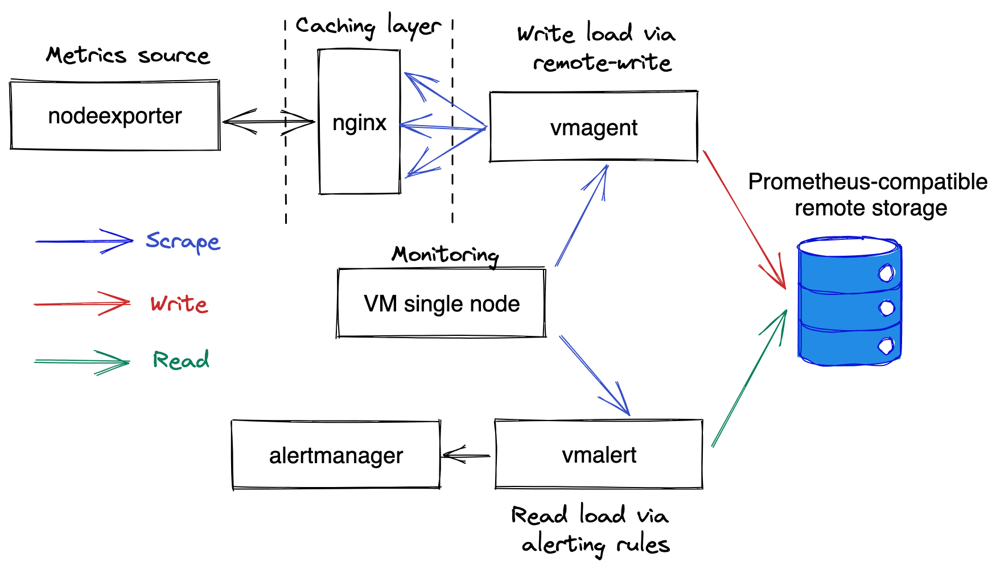

# Prometheus benchmark

Prometheus-benchmark allows testing data ingestion and querying performance
for Prometheus-compatible systems on production-like workload.

Prometheus-benchmark provides the following features:

- It generates production-like workload for both data ingestion and querying paths:
  - It generates write workload from real [node_exporter](https://github.com/prometheus/node_exporter) metrics.
    This is the most frequently used exporter for Prometheus metrics.
  - It generates read workload from typical alerting rules for `node_exporter` metrics - see [chart/files/alerts.yaml](chart/files/alerts.yaml).
- It allows generating [time series churn rate](https://docs.victoriametrics.com/FAQ.html#what-is-high-churn-rate)
  via [scrapeConfigUpdatePercent](https://github.com/VictoriaMetrics/prometheus-benchmark/blob/f6a69052413618c607758d5469e43e508792aff7/chart/values.yaml#L30)
  and [scrapeConfigUpdateInterval](https://github.com/VictoriaMetrics/prometheus-benchmark/blob/f6a69052413618c607758d5469e43e508792aff7/chart/values.yaml#L38)
  options. The churn rate is typical for Kubernetes monitoring.
- Multiple systems can be tested simultaneously - just add multiple named entries
  under `remoteStorages` section at [chart/values.yaml](chart/values.yaml).

The following systems can be tested with prometheus-benchmark:

- [Single-node version of VictoriaMetrics](https://docs.victoriametrics.com/Single-server-VictoriaMetrics.html):
  - [How to push data to VictoriaMetrics](https://docs.victoriametrics.com/#prometheus-setup)
  - [How to query data from VictoriaMetrics](https://docs.victoriametrics.com/url-examples.html#apiv1query)
- [Cluster version of VictoriaMetrics](https://docs.victoriametrics.com/Cluster-VictoriaMetrics.html):
  - [How to push and query data in cluster version of VictoriaMetrics](https://docs.victoriametrics.com/Cluster-VictoriaMetrics.html#url-format)
- [Grafana Mimir](https://grafana.com/oss/mimir/):
  - [How to push data to Mimir](https://grafana.com/docs/mimir/latest/operators-guide/reference-http-api/#remote-write)
  - [How to query data from Mimir](https://grafana.com/docs/mimir/latest/operators-guide/reference-http-api/#instant-query)
- [Cortex](https://github.com/cortexproject/cortex):
  - [How to push data to Cortex](https://cortexmetrics.io/docs/api/#remote-write)
  - [How to query data from Cortex](https://cortexmetrics.io/docs/api/#instant-query)
- [Thanos](https://github.com/thanos-io/thanos/):
  - [How to push data to Thanos](https://thanos.io/tip/components/receive.md/)
  - [How to query data from Thanos](https://thanos.io/tip/components/query.md/)

## How does it work?

The prometheus-benchmark scrapes metrics from [node_exporter](https://github.com/prometheus/node_exporter)
and pushes the scraped metrics to the configured Prometheus-compatible remote storage systems.
These systems must support [Prometheus remote_write API](https://prometheus.io/docs/prometheus/latest/configuration/configuration/#remote_write)
for measuring data ingestion performance. Optionally these systems may support
[Prometheus querying API](https://prometheus.io/docs/prometheus/latest/querying/api/#instant-queries) for measuring query performance.



The helm chart deploys the following pods:

- `vmagent` with the following containers:
  - [nodeexporter](https://github.com/prometheus/node_exporter) - collects real metrics from Kubernetes node where it runs.
  - [nginx](https://nginx.org/) - caches responses from `nodeexporter` for 1 second in order to reduce load on it
    when scraping big number of targets.
  - [vmagent-config-updater](services/vmagent-config-updater/README.md) - generates config for target scraping.
    It is also responsible for generating time series churn rate via periodic updating of the generated targets.
  - [vmagent](https://docs.victoriametrics.com/vmagent.html) - scrapes `nodeexporter` metrics via `nginx`
    for targets generated by `vmagent-config-updater`.
- `vmalert` with the following containers:
  - [vmalert](https://docs.victoriametrics.com/vmalert.html) - periodically executes [these alerting rules](chart/files/alerts.yaml)
    (aka read queries) against the testes remote storage.
  - [alertmanager](https://github.com/prometheus/alertmanager) - receives notifications from `vmalert`.
    It is configured as a blackhole for the received notifications.
  `vmalert` pod is optional - it is used for generating read query load.
- `vmsingle` - this pod runs a [single-node VictoriaMetrics](https://docs.victoriametrics.com/), which collects metrics from `vmagent` and `vmalert` pods,
  so they could be analyzed during benchmark execution.

## Articles

- [Benchmarking Prometheus-compatible time series databases](https://victoriametrics.com/blog/remote-write-benchmark/)
- [Monitoring benchmark: how to generate 100 million samples/s of production-like data](https://victoriametrics.com/blog/benchmark-100m/)
- [Grafana Mimir and VictoriaMetrics: performance tests](https://victoriametrics.com/blog/mimir-benchmark/)

## How to run

It is expected that [Helm3](https://helm.sh/docs/intro/install/) is already installed
and configured to communicate with Kubernetes cluster where the prometheus-benchmark should run.

Check out the prometheus-benchmark sources:

```bash
git clone https://github.com/VictoriaMetrics/prometheus-benchmark
cd prometheus-benchmark
```

Then edit the [chart/values.yaml](chart/values.yaml) with the desired config params.
Then optionally edit the [chart/files/alerts.yaml](chart/files/alerts.yaml)
with the desired queries to execute at remote storage systems.
Then run the following command in order to install the prometheus-benchmark
components in Kubernetes and start the benchmark:

```bash
make install
```

Run the following command in order to inspect the metrics collected by the benchmark:

```bash
make monitor
```

After that go to `http://localhost:8428/targets` in order to see which metrics are collected by the benchmark.
See [monitoring docs](#monitoring) for details.

After the benchmark is complete, run the following command for removing prometheus-benchmark components from Kubernetes:

```bash
make delete
```

By default the `prometheus-benchmark` is deployed in `vm-benchmark` Kubernetes namespace.
The namespace can be overridden via `NAMESPACE` environment variable.
For example, the following command starts the `prometheus-benchmark` chart in `foobar` k8s namespace:

```bash
NAMESPACE=foobar make install
```

See the [Makefile](Makefile) for more details on available `make` commands.

## Monitoring

The benchmark collects various metrics from its components. These metrics
are available for querying at `http://localhost:8428/vmui` after running `make monitor` command.
The following metrics might be interesting to look at during the benchmark:

- Data ingestion rate:

```metricsql
sum(rate(vm_promscrape_scraped_samples_sum{job="vmagent"})) by (remote_storage_name)
```

- 99th percentile for the duration to execute queries at [chart/files/alerts.yaml](chart/files/alerts.yaml):

```metricsql
max(vmalert_iteration_duration_seconds{quantile="0.99",job="vmalert"}) by (remote_storage_name)
```

- 99th percentile for the duration to push the collected data to the configured
  remote storage systems at [chart/values.yaml](chart/values.yaml):

```metricsql
histogram_quantile(0.99,
  sum(increase(vmagent_remotewrite_duration_seconds_bucket{job="vmagent"}[5m])) by (vmrange,remote_storage_name)
)
```

It is recommended also to check the following metrics in order to verify whether the configured remote storage is capable to handle the configured workload:

- The number of dropped data packets when sending them to the configured remote storage.
  If the value is bigger than zero, then the remote storage refuses to accept incoming data.
  It is recommended inspecting remote storage logs and vmagent logs in this case.

```metricsql
sum(rate(vmagent_remotewrite_packets_dropped_total{job="vmagent"})) by (remote_storage_name)
```

- The number of retries when sending data to remote storage. If the value is bigger than zero,
  then this is a sign that the remote storage cannot handle the workload.
  It is recommended inspecting remote storage logs and vmagent logs in this case.

```metricsql
sum(rate(vmagent_remotewrite_retries_count_total{job="vmagent"})) by (remote_storage_name)
```

- The amounts of pending data at vmagent side, which isn't sent to remote storage yet.
  If the graph grows, then the remote storage cannot keep up with the given data ingestion rate.
  Sometimes increasing the `writeConcurrency` at [chart/values.yaml](chart/values.yaml)
  may help if there is a high network latency between vmagent at prometheus-benchmark
  and the remote storage.

```metricsql
sum(vm_persistentqueue_bytes_pending{job="vmagent"}) by (remote_storage_name)
```

- The number of errors when executing queries from [chart/files/alerts.yaml](chart/files/alerts.yaml).
  If the value is bigger than zero, then the remote storage cannot handle the query workload.
  It is recommended inspection remote storage logs and vmalert logs in this case.

```metricsql
sum(rate(vmalert_execution_errors_total{job="vmalert"})) by (remote_storage_name)
```

The `prometheus-benchmark` doesn't collect metrics from the tested remote storage systems.
It is expected that a separate monitoring is set up for whitebox monitoring
of the tested remote storage systems.
